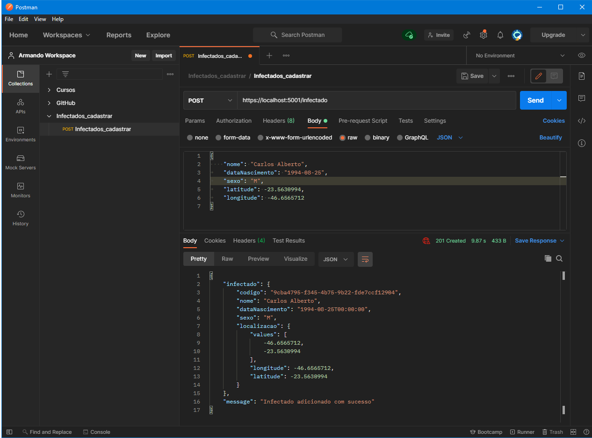
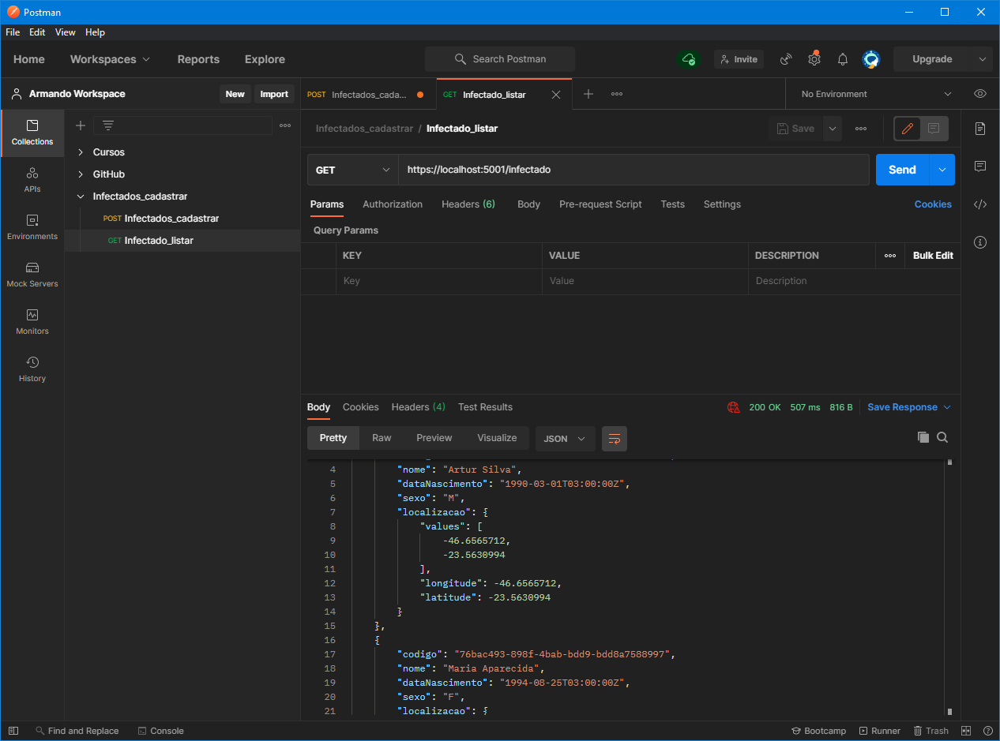
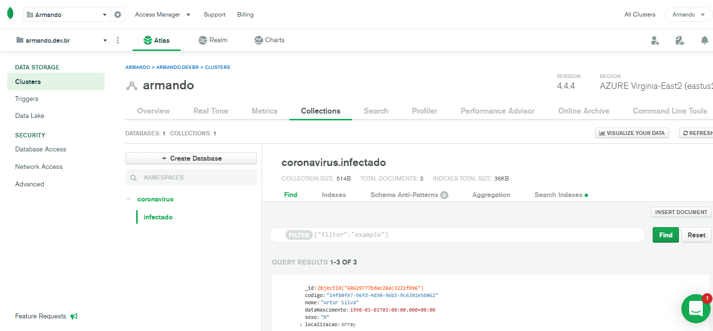

<h1 align="center">
:computer: Construindo um projeto de uma API.NET integrada ao MongoDB
</h1>

<h1 align="center">

</h1>

<p align="center">
    <a href="https://www.linkedin.com/in/dev-full-stack/">
        
    </a>
</p>

---

### ⚔ Desafio

Desafio feito no Bootcamp da Digital Innovation One.

Esse projeto é uma API em .NET Core integrada a um cluster MongoDB, criado no service cloud Mongo Atlas. 

O objetivo desse desavio foi repassar os conceitos básicos de front-end, back-end, bases de dados, NoSQL e MongoDB para fixar o entendimento e sua aplicabilidade.


Para teste:

https://localhost:5001/infectado

```json
{
	"nome": "Maria Aparecida",
	"dataNascimento": "1990-03-01",
	"sexo": "M",
	"latitude": -23.5630994,
	"longitude": -46.6565712
}
```
OBS: é preciso ter configurar o acesso ao banco no appsettings.

---

### 📷 Screenshots





---

## 🛠️ Tecnologias Utilizadas
- .Net Core;
- C#;
- MongoDB;
- NoSQL;
- HTML5;
- CSS3;
- JavaScript;

## ⏬ Como baixar o projeto
- <b style="color:red"> OBS: </b> É necessário ter o git instalado em sua máquina
- Executar o Seguinte comando no seu **Terminal** ou no **CMD**:

```bash
        git clone https://github.com/armandofc1/dotnetMongoInfectados.git
```
### 📚 Referências

https://docs.mongodb.com/

https://docs.mongodb.com/manual/

https://docs.mongodb.com/ecosystem/drivers/csharp/

https://docs.atlas.mongodb.com/

Links Uteis:

- .net core - https://dotnet.microsoft.com/download

- visual code - https://code.visualstudio.com/download

- postman - https://www.postman.com/downloads/

- mongo atlas - https://www.mongodb.com/cloud/atlas/register

## ⌨️ Autor

<br>
<sub><b>Armando Costa</b></sub>

##### Contatos
[](https://www.linkedin.com/in/dev-full-stack/)
